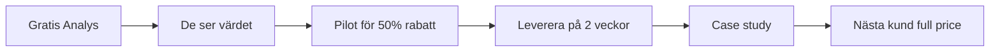

# 🎯 FOKUSPLAN: Från Idé till Första Kunden

## Sluta Drömma, Börja Göra

### Problem Som Folk BETALAR För Att Lösa:

#### 1. Legacy Migration (BÄSTA VALET)
**Värde**: $50k-500k per projekt
**Smärta**: "Vår gamla PHP-app kostar fortune att underhålla"
**Din lösning**: Migrera till modern stack på 2 veckor

#### 2. API Automation
**Värde**: $10k-100k
**Smärta**: "Vi behöver API men har inte tid/kunskap"
**Din lösning**: Generera production-ready API på 1 dag

#### 3. Test Coverage
**Värde**: $20k-200k
**Smärta**: "Vi har 0% test coverage och vågar inte deploya"
**Din lösning**: 80% coverage på 1 vecka

## VECKA 1: Bygg Minimal Lösning

### Måndag-Tisdag: LangChain Setup
```python
# Installera och lär dig basics
pip install langchain langchain-anthropic langsmith

# Bygg första kedjan som faktiskt gör något
# Se langchain-integration.md
```

### Onsdag-Torsdag: En FUNGERANDE Demo
```python
# Välj ETT problem (föreslår Legacy Migration)
# Bygg demo som:
1. Analyserar legacy kod
2. Genererar migration plan
3. Skapar ny kod
4. Visar före/efter

# Detta tar 2 dagar MAX
```

### Fredag: Dokumentera Resultat
```markdown
# Case Study: 10x Snabbare Migration

## Före (Traditional Consulting):
- Tid: 6 månader
- Kostnad: $300,000
- Risk: Hög

## Efter (DATAZENtr):
- Tid: 2 veckor
- Kostnad: $30,000
- Risk: Låg (proven patterns)

## ROI: 900%
```

## VECKA 2: Hitta Första Kunden

### Var Du Hittar Dem:
1. **LinkedIn**: Sök "CTO" + "legacy" + "modernization"
2. **Lokala företag**: Ring 10 företag, fråga om de har gamla system
3. **Ditt nätverk**: Någon känner någon med legacy system

### Pitchen (30 sekunder):
> "Vi migrerar legacy-system till modern stack på 2 veckor för 10% av vad Accenture tar. Vi använder AI-orkestrering som redan lärt sig från 1000+ migrationer. Första analysen är gratis."

### Erbjudandet:
```
GRATIS Legacy Analysis (Värde $5,000)
- Skannar hela kodbasen
- Identifierar risker
- Ger migration roadmap
- Estimerar kostnad/tid

Om de gillar analysen → Fixed price migration
```

## VECKA 3-4: Leverera

### Pilot Customer Workflow:


## Sluta Fokusera På:
❌ Perfekt arkitektur
❌ Alla features
❌ Skalning till miljoner users
❌ Fancy UI

## Fokusera På:
✅ ETT problem
✅ EN lösning
✅ EN kund
✅ LEVERERA något

## Konkreta Nästa Steg:

### Steg 1: Välj ETT Problem
```bash
[ ] Legacy Migration - REKOMMENDERAT
[ ] API Generation
[ ] Test Automation
```

### Steg 2: Bygg Minimal Demo (2 dagar)
```bash
[ ] LangChain + Neural DB integration
[ ] Input: Legacy kod
[ ] Output: Ny kod + migration plan
[ ] Mät: Tid sparad, kostnad sparad
```

### Steg 3: Skapa Enkelt Säljmaterial
```bash
[ ] One-pager PDF
[ ] 5-minute demo video
[ ] ROI kalkylator
[ ] LinkedIn post
```

### Steg 4: Kontakta 10 Potentiella Kunder
```bash
[ ] Lista 10 företag med legacy system
[ ] Personligt meddelande till CTO/Tech Lead
[ ] Erbjud gratis analys
[ ] Boka möte med minst 3
```

### Steg 5: Leverera Första Projektet
```bash
[ ] Gratis analys för pilot customer
[ ] 50% rabatt på första migrationen
[ ] Över-leverera
[ ] Få testimonial
[ ] Case study
```

## Success Metrics:

### Vecka 1:
- ✅ Fungerande demo
- ✅ Dokumenterad ROI

### Vecka 2:
- ✅ 10 outreach
- ✅ 3 möten bokade
- ✅ 1 pilot customer

### Månad 1:
- ✅ 1 levererat projekt
- ✅ 1 betalande kund
- ✅ $10,000+ i intäkter

## Kom Ihåg:

> "Version one is better than version none"

> "Done is better than perfect"

> "Ship something TODAY"

---

## Den Enkla Sanningen:

Du har redan ALLT du behöver:
- Neural Database ✅
- Agent Orchestration ✅
- LangChain (2 dagars learning) ✅
- Ett RIKTIGT problem att lösa ✅

**Sluta planera. Börja bygga. Få första kunden. Iterate.**

När du har EN betalande kund som är nöjd, då kan du börja tänka på skalning. Inte förr.