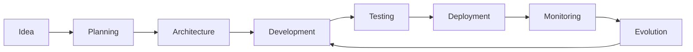

# Workflow: Complete Project Lifecycle
Version: 1.0.0
Type: Master Workflow
Duration: Variable (days to months)

## Overview
End-to-end workflow from idea to production, leveraging all THE_DATAZENtr systems.

## Workflow Stages



## Stage 1: Idea Inception
**Location**: `Projects/Planning/`
**Duration**: 1-2 days

### Actions
1. Document initial concept
2. Search Neural DB for similar projects
3. Identify reusable components
4. Define success criteria

### Skills Used
- `/skill project-genesis`
- `/skill market-research`

### Neural DB Queries
```python
# Find similar projects
patterns = await memory.recall(f"{project_type} {domain}")

# Get successful patterns
top_patterns = await memory.db.get_top_patterns(
    context=domain,
    pattern_type="architecture"
)
```

## Stage 2: Architecture Planning
**Location**: `Projects/Planning/[project-name]/`
**Duration**: 2-3 days

### Actions
1. Design system architecture
2. Select technology stack
3. Plan microservices/modules
4. Define APIs

### Skills Used
- `/skill architecture-design`
- `/skill api-design`
- `/skill database-design`

### Service Integrations
- PostgreSQL setup
- Redis configuration
- n8n workflow design
- External API planning

### SOVEREIGN Orchestration
```yaml
orchestration:
  pattern: ARCHITECT-EXECUTOR
  architects:
    - SystemArchitect
    - DataArchitect
    - SecurityArchitect
  executors:
    - CodeGenerator
    - ConfigBuilder
    - DocWriter
```

## Stage 3: Development Sprint
**Location**: `Projects/Active/[project-name]/`
**Duration**: 1-4 weeks

### Actions
1. Implement core features
2. Write tests
3. Create documentation
4. Setup CI/CD

### Daily Workflow
```python
async def daily_development():
    # Morning: Check Neural DB for overnight insights
    insights = await memory.db.get_global_insights()

    # Development: Apply patterns
    for task in today_tasks:
        patterns = await memory.recall(task.description)
        result = await execute_with_patterns(task, patterns)
        await memory.track(task, result)

    # Evening: Sync learnings
    await memory.end_session()
```

### Skills Rotation
- `/skill tdd-development` (Morning)
- `/skill refactoring` (Afternoon)
- `/skill code-review` (Evening)

## Stage 4: Testing & Quality
**Duration**: 3-5 days

### Testing Pyramid
```
        /\
       /E2E\      <- 10%
      /------\
     /  Integ  \    <- 20%
    /------------\
   /     Unit     \   <- 70%
  /----------------\
```

### Automated Testing
```bash
# Unit tests
pytest tests/unit/ --cov=src/

# Integration tests
pytest tests/integration/

# E2E tests
npm run test:e2e

# Performance tests
k6 run tests/load/
```

### Neural Validation
- Check patterns against success metrics
- Validate architecture decisions
- Verify performance benchmarks

## Stage 5: Deployment
**Duration**: 1 day

### Deployment Checklist
- [ ] All tests passing
- [ ] Documentation complete
- [ ] Monitoring configured
- [ ] Rollback plan ready
- [ ] Neural DB patterns saved

### Deployment Strategies
```yaml
strategies:
  blue_green:
    when: "major_release"
    rollback: "automatic"

  canary:
    when: "feature_release"
    traffic: "5% -> 25% -> 50% -> 100%"

  rolling:
    when: "patch_release"
    batch_size: "25%"
```

## Stage 6: Production Monitoring
**Duration**: Ongoing

### Monitoring Stack
```python
monitoring = {
    "metrics": ["response_time", "error_rate", "throughput"],
    "logs": ["application", "system", "security"],
    "traces": ["user_journey", "api_calls", "db_queries"],
    "alerts": ["downtime", "performance", "security"]
}
```

### Learning Loop
```python
async def production_learning():
    # Collect metrics
    metrics = await collect_production_metrics()

    # Identify patterns
    patterns = analyze_patterns(metrics)

    # Save to Neural DB
    for pattern in patterns:
        await memory.remember(
            f"prod_pattern_{pattern.type}",
            pattern.data,
            pattern_type="operational"
        )

    # Generate insights
    insights = await generate_insights(patterns)

    # Feed back to development
    await create_improvement_tasks(insights)
```

## Stage 7: Evolution & Growth
**Duration**: Ongoing

### Feature Evolution
1. Analyze usage patterns
2. Identify improvement areas
3. Plan next iteration
4. Return to Development stage

### Knowledge Accumulation
```python
# Project graduation criteria
if project.maturity_score > 0.8:
    # Move to graduated
    await move_to_graduated(project)

    # Extract reusable components
    components = await extract_components(project)

    # Add to Skills Library
    for component in components:
        await create_skill(component)

    # Document learnings
    await document_patterns(project)
```

## Integration Points

### Neural Database
- Every decision logged
- All patterns tracked
- Success/failure recorded
- Insights generated

### SOVEREIGN Agents
- Orchestrate complex tasks
- Quality gates at each stage
- Automated code generation
- Self-healing capabilities

### External Services
- n8n for workflow automation
- GitHub for version control
- Docker for containerization
- Cloud providers for hosting

## Success Metrics

### Speed Metrics
- Time to first commit: <1 day
- Time to MVP: <1 week
- Time to production: <1 month

### Quality Metrics
- Code coverage: >80%
- Documentation: 100%
- Security vulnerabilities: 0
- Performance: <200ms p95

### Learning Metrics
- Patterns discovered: >10 per project
- Reuse rate: >50%
- Success rate improvement: >10% per iteration

## Rollback Procedures

### At Any Stage
```bash
# Rollback to previous stable state
git checkout last_stable_tag

# Restore database
docker exec neural-memory-db psql -U neural < backup.sql

# Revert configurations
kubectl rollout undo deployment/app

# Notify team
/notify rollback-initiated
```

## Post-Project Review

### Review Template
1. **What worked well?**
   - Successful patterns
   - Effective tools
   - Good decisions

2. **What didn't work?**
   - Failed approaches
   - Bottlenecks
   - Technical debt

3. **What did we learn?**
   - New patterns
   - Better approaches
   - Tool improvements

4. **What should we change?**
   - Workflow updates
   - Skill additions
   - Service changes

### Knowledge Preservation
```python
async def preserve_project_knowledge():
    # Create project summary
    summary = await generate_project_summary()

    # Extract patterns
    patterns = await extract_successful_patterns()

    # Document failures
    failures = await document_failures_and_fixes()

    # Create skills
    skills = await generate_reusable_skills()

    # Update Neural DB
    await memory.remember(
        f"project_complete_{project.name}",
        {
            "summary": summary,
            "patterns": patterns,
            "failures": failures,
            "skills": skills,
            "metrics": project.metrics
        },
        pattern_type="project_lifecycle"
    )
```

## Related Workflows
- `/workflow agile-sprint` - 2-week sprint cycle
- `/workflow hotfix-deploy` - Emergency fixes
- `/workflow feature-flag` - Feature rollout
- `/workflow data-migration` - Database updates